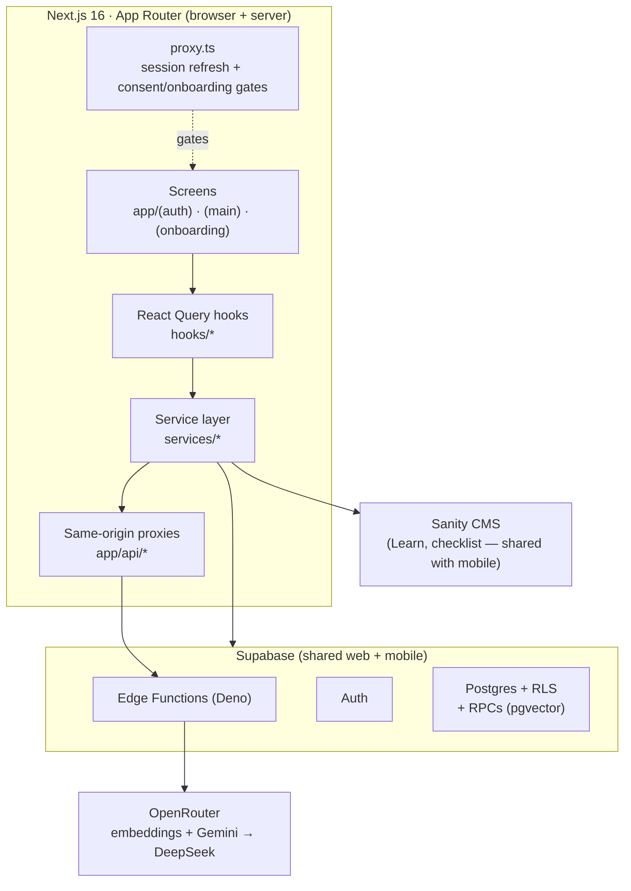
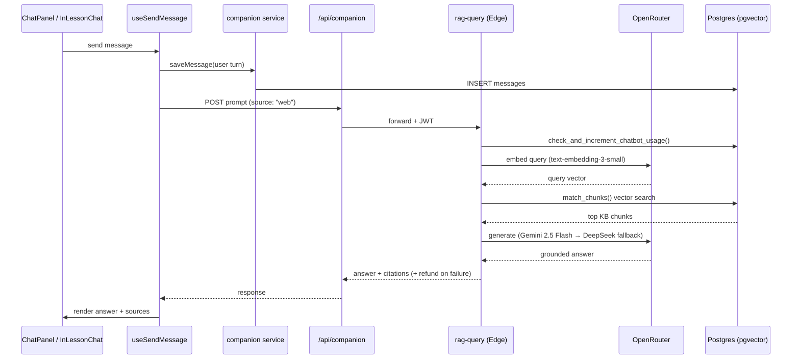

# Unify — Web App

> A web platform helping newcomers settle in Canada — community, personalized
> checklists, AI-powered guidance, career tools, and multilingual educational content.


Unify supports immigrants, refugees, international students, and skilled workers
through their settlement journey in Canada. This repository is the **web app** — the
browser companion to the Unify React Native mobile app (private repo), mirroring
its features and sharing one production backend. It is a real, in-production product:
Auth, social feed, community, an AI RAG assistant, a personalized checklist, a
multilingual learning platform, and AI-assisted resume and cover-letter builders are
all wired to live data.

---

## Feature Overview

| Feature | What it does | Backing tech |
| --- | --- | --- |
| **Home / Social feed** | For You / Following / Groups feeds, posts, likes, saves, threaded comments, post detail pages | Supabase + keyset pagination |
| **Community** | Groups, Events, News, and peer-matching Circles | Supabase (mobile-mirrored schema) |
| **Companion** | AI assistant grounded in Unify content, with citations | RAG over pgvector + OpenRouter |
| **Checklist** | Persona- and stage-personalized settlement tasks | Sanity templates + Supabase progress |
| **Learn** | Modules → submodules → lessons, quizzes, highlights, in-lesson AI help | Sanity Portable Text + Supabase |
| **Profile & social graph** | Profiles, follow/unfollow, followers/following, comment history | Supabase + RLS |
| **Resume Builder** | AI chat that drafts a structured resume, targets a job posting, imports an existing PDF/DOCX, exports DOCX | `resume-chat` edge fn + OpenRouter |
| **Cover Letter** | AI generator from a job posting (+ optional resume), PDF/DOCX import | `cover-letter-chat` edge fn |
| **Internationalization** | 6 shipped languages incl. Arabic (RTL) + on-demand translation of user content | i18next + `translate-content` edge fn |
| **Auth** | Google OAuth + full email/password flow with legal-consent gating | Supabase Auth |

---

## Architecture



The web app never calls the AI providers directly. Browser requests hit **same-origin
`/api/*` proxy routes**, which forward to **Supabase Edge Functions** (several of them
shared with mobile and without permissive CORS), which in turn call **OpenRouter**.
Secrets stay server-side; the browser only ever holds the Supabase anon key.

---

## Features in Detail

The app is organized around a primary navigation of five sections plus Profile.
On desktop (≥ `md`) this is a fixed left icon rail (`components/layout/Sidebar.tsx`);
on mobile (< `md`) it becomes a fixed bottom tab bar (`components/layout/BottomNav.tsx`),
both driven by a single source of truth (`components/layout/navItems.ts`). Resume
Builder and Cover Letter are desktop-only entries.

### Home / Social feed

Three sub-feeds — **For You**, **Following**, and **Groups** — with keyset cursor
pagination (cursors are `created_at` timestamps, not offsets). Post cards carry likes,
comments, saves, group badges, and a pinned indicator. Comments are **threaded with
replies** and have a dedicated post-detail route (`app/(main)/post/[postId]`) with
deep-link anchors to individual comments. A right-hand widget panel shows Learning
Progress and a National News list.

### Community

Browse and join **Groups**, discover typed **Events** (in-person / online / hybrid,
with detail routes), read **News**, and access **Circles** — peer matching that groups
users with similar backgrounds (persona + time in Canada) into small support circles.
Circle waitlist join/leave is wired against the mobile-mirrored schema; the matching
engine is deferred and the Circles tab is currently hidden to mirror the mobile launch
navigation.

### Companion (AI assistant)

An AI assistant powered by **Retrieval-Augmented Generation** over a curated knowledge
base, served by the shared `rag-query` Supabase Edge Function. It supports conversation
history, starter prompts, and **source citations**. The same backend powers in-lesson
help in Learn (`components/learn/help/InLessonChat.tsx`) by passing a `lessonContext`.
Free tier: **6 messages/day**, enforced by a `SECURITY DEFINER` Postgres RPC with a
quota refund when a generation fails.



### Checklist

Personalized onboarding tasks based on the user's **persona** (international student,
skilled worker, refugee, other) and **time in Canada** (0–3 months through 3+ years).
Tasks come from Sanity, bucketed into four priorities (Do now → Do soon → Explore &
connect → Optional / later), with per-user completion, user-created custom tasks, and
drag-to-reorder (`@dnd-kit`) tracked in Supabase.

### Learn

Structured educational **modules → submodules → lessons** rendered from Sanity
Portable Text with custom content blocks (example / tip / note callouts, dropdowns,
images, checklist items). Includes a paginated lesson reader with keyboard paging,
section **Practice** quizzes and lesson **Quick Checks** (free-text answers graded by
the `practice-feedback` edge function), text-selection **highlights** with an **Ask AI**
explainer (`explain-term` edge function), whole-word search, and per-user progress
tracking.

### Profile & social graph

Own profile (avatar, stats, persona badge, city/province, settlement stage, and Posts /
Saved / Highlights / Comments tabs) and other-user profiles with **follow/unfollow**,
followers/following lists, a "Follows you" badge, comment-author links, and a
"Member since" indicator.

### Resume Builder & Cover Letter

Two AI-assisted career tools built on the same pattern:

- **Resume Builder** (`app/(main)/resume/`) — a conversational AI drafts a structured
  resume, can **target a specific job posting**, **imports an existing PDF/DOCX resume**,
  and exports to DOCX.
- **Cover Letter** (`app/(main)/cover-letter/`) — generates a tailored cover letter from
  a job posting plus an optional resume reference, with the same PDF/DOCX import.

Each returns strict JSON turns from DeepSeek (via OpenRouter) through its own edge
function (`resume-chat` / `cover-letter-chat`) behind a same-origin proxy, is capped at
**20 messages/day per user** with refund-on-empty-turn, and persists drafts to Supabase.
Document import shares one hardened extraction path (`lib/documents/`) — PDF via `unpdf`,
DOCX via `mammoth` — with a 4MB cap and a DOCX zip-bomb guard.

### Internationalization

The UI ships in **6 languages** — English, Tiếng Việt (Vietnamese), Español, हिन्दी
(Hindi), العربية (Arabic, **RTL**), and Français canadien — matching the mobile app's
set, with Punjabi (ਪੰਜਾਬੀ) present as an opt-in pending native review. Built on
`i18next` / `react-i18next`; language is persisted to the `unify_lang` cookie and
synced cross-device via `user_onboarding_profiles.preferred_language`. The SSR root
layout renders the correct `<html lang>` / `dir` with no flash of English. **RTL
mirroring** is handled throughout for Arabic. **User-generated content** (posts,
comments, in-lesson discussions) translates on demand through the `translate-content`
edge function, server-cached with a per-user daily quota. Locale-key parity is enforced
in CI by `npm run check-i18n`.

### Auth & Onboarding

- **Auth:** Google OAuth **and** full email/password are both live. Email/password
  covers a welcome carousel → signup / login / verify-email (6-digit OTP) /
  forgot-password / reset-password / a `before-you-continue` legal-consent gate
  (`app/(auth)/`, `services/auth.ts`). The OAuth callback bootstraps the `public.users`
  row (`lib/supabase/ensureUserRow.ts`).
- **Onboarding:** an 11-step mobile-parity wizard (name → persona → referral source →
  arrival date → location → goals → learning interests → hobbies → learning reminders →
  outcome preview → confirmation), editable later from the profile header. Settlement
  stage is computed via `lib/onboarding/calculateUserStage.ts`.
- **Mock fallback:** every section falls back to realistic Canadian-newcomer mock data
  (`lib/mock/`) when Supabase / Sanity env vars aren't set — the whole UI runs end-to-end
  with no backend for local dev.
- **Image upload:** avatars and post images upload through a hardened signed-URL CORS
  proxy (`app/api/storage/route.ts`).

> **Not built on web (by design):** push notifications, analytics/tracking SDKs, and
> premium/paywall gating — see "What NOT to build yet" in `CLAUDE.md`.

---

## Tech Stack

| Layer | Technology |
| --- | --- |
| Framework | Next.js 16 (App Router) |
| Language | TypeScript |
| UI | React 19, Tailwind CSS v4 (`@theme` brand tokens), lucide-react |
| State | TanStack React Query v5 (server state), component state (local) |
| Backend | Supabase — Auth, PostgreSQL + RLS, Edge Functions (Deno) |
| CMS | Sanity (Learn content + checklist templates; shared with mobile) |
| AI | OpenRouter — embeddings + Gemini 2.5 Flash → DeepSeek V4.1 Flash fallback, behind Supabase Edge Functions |
| i18n | `i18next` / `react-i18next`, 6 languages incl. Arabic (RTL) + Canadian French |
| Docs | PDF via `unpdf`, DOCX read via `mammoth`, DOCX export via `docx` |
| DnD | `@dnd-kit` (checklist reorder) |
| Fonts | Inter (`next/font/google`) |
| Utilities | clsx, tailwind-merge |

---

## Key Engineering Patterns

- **Service + hook wiring** (`services/*` + `hooks/*`) — every section follows one
  template: `isSupabaseConfigured()` + `getAuthUserId()` guards, snake_case → camelCase
  row mappers, and React Query hooks with stable query keys and `onSuccess`
  invalidation. Components call hooks only.
- **Mock fallback** — `lib/mock/*` is the data source when env vars aren't configured,
  so the UI runs end-to-end without a backend.
- **Keyset cursor pagination** — `services/feed.ts` paginates feeds by `created_at`
  cursor (not offset), ready for infinite scroll.
- **Edge-function proxying** — CORS-less shared edge functions are fronted by
  same-origin `app/api/*` routes that attach the user's JWT and tag requests
  `source: "web"`.
- **Singleton browser client** — `lib/supabase/client.ts` returns one browser client to
  avoid multiple `GoTrueClient` instances.
- **Session refresh + gated routing** — `proxy.ts` (Next 16's middleware successor)
  refreshes the session, redirects unauthenticated traffic to `/welcome`, then runs two
  ordered gates: legal consent, then onboarding.
- **Portable Text rendering** — `components/learn/PortableTextRenderer.tsx` renders
  Sanity lessons including the custom content-block types.

---

## Backend: Edge Functions & RPCs

**Supabase Edge Functions (Deno)** — several shared with mobile:

| Function | Purpose |
| --- | --- |
| `rag-query` | Embeds the query (OpenRouter), retrieves KB chunks via `match_chunks`, returns a grounded answer with citations. Shared web + mobile. |
| `translate-content` | On-demand, server-cached translation of user-generated content. |
| `explain-term` | "Ask AI" explainer for a selected term/phrase in a lesson. |
| `practice-feedback` | AI grading/feedback on free-text practice answers. |
| `get-daily-tip` | Generates/serves the daily tip. |
| `resume-chat` | One conversational turn of the Resume Builder (strict JSON via DeepSeek). |
| `cover-letter-chat` | One conversational turn of the Cover Letter generator. |
| `events-crawler` | Crawls BC settlement-org and library events into `public.events`. |
| `news-crawler` | Weekly Canada/immigration news into `public.news_details`. |

**Same-origin proxy routes** (`app/api/*`): `companion`, `translate`, `resume`
(+ `resume/job-posting`), `cover-letter`, `storage`, `documents/extract`, `moderation`,
`account`, `onboarding-profile`.

**Postgres RPCs** include `match_chunks` (RAG vector search),
`check_and_increment_chatbot_usage` / `refund_chatbot_message`,
`check_and_increment_resume_usage` / `refund_resume_message`,
`check_and_increment_cover_letter_usage` / `refund_cover_letter_message`,
`get_post_metadata_batch`, `pin_post` / `unpin_post`, `merge_highlights`, and
`is_circle_member`.

---

## Project Structure

```text
web-app/
├── app/                          # Next.js App Router
│   ├── (auth)/                   # welcome, signup, login, verify-email,
│   │   │                         #   forgot/reset-password, before-you-continue, callback
│   │   └── auth/callback/        # OAuth code exchange
│   ├── (main)/                   # Authenticated shell (sidebar / bottom nav + content)
│   │   ├── home/                 # 3-column social feed
│   │   ├── community/            # Groups, Events, News, Circles
│   │   ├── companion/            # AI assistant
│   │   ├── checklist/            # Onboarding tasks (drag-to-reorder)
│   │   ├── learn/                # Modules → submodules → lessons + practice
│   │   ├── profile/              # Own + other-user profiles
│   │   ├── post/[postId]/        # Post detail + threaded comments
│   │   ├── resume/               # AI Resume Builder
│   │   └── cover-letter/         # AI Cover Letter generator
│   ├── (onboarding)/onboarding/  # 11-step wizard
│   └── api/                      # Same-origin proxies to edge functions
├── components/
│   ├── ui/                       # Avatar, Button, Badge, PriorityBadge, Tabs
│   ├── layout/                   # Sidebar, BottomNav, navItems
│   └── home/ community/ companion/ checklist/ learn/ profile/ onboarding/ resume/ …
├── hooks/                        # React Query hooks
├── services/                     # Supabase / Sanity queries + mock fallback
├── lib/
│   ├── supabase/                 # client (singleton), server, ensureUserRow
│   ├── i18n/                     # config, provider, locales/<lang>/translation.json
│   ├── resume/ coverLetter/      # schemas, prompts, DOCX export, edit ops
│   ├── documents/                # PDF/DOCX text extraction + validation
│   ├── onboarding/               # settlement-stage calculation
│   ├── sanity.ts                 # Sanity client + GROQ queries
│   ├── mock/                     # local-dev fallback data
│   └── utils.ts                  # cn() helper
├── proxy.ts                      # session refresh + gated routing (Next 16)
├── supabase/
│   ├── migrations/               # schema + RLS + grants + RPCs
│   └── functions/                # Edge functions (Deno) + _shared
├── scripts/check-i18n-parity.mjs # locale-key parity check
└── design-system/MASTER.md       # design source of truth
```

---

## Getting Started

### Prerequisites

- Node.js 22 (an `.nvmrc` is included — run `nvm use`)
- npm

### Installation

```bash
git clone <repository-url>
cd Unify/web-app
nvm use
npm install
```

### Environment

Create a `.env.local` in `web-app/` with:

```bash
NEXT_PUBLIC_SUPABASE_URL=         # Supabase project URL
NEXT_PUBLIC_SUPABASE_ANON_KEY=    # Supabase anon key
NEXT_PUBLIC_SANITY_PROJECT_ID=    # Sanity project ID
NEXT_PUBLIC_SANITY_DATASET=       # Sanity dataset (e.g. production)
```

Without these, the app runs entirely on mock data (`lib/mock/`). AI keys are **not** web
env vars — they're Supabase edge-function secrets set with `supabase secrets set`. The
only AI key web needs is `OPENROUTER_API_KEY` (both embeddings and generation go through
OpenRouter; `OPENAI_API_KEY` is unused by web). Optional i18n kill-switches:
`NEXT_PUBLIC_ENABLE_ARABIC` / `NEXT_PUBLIC_ENABLE_FRENCH` (default on),
`NEXT_PUBLIC_ENABLE_PUNJABI` (default off).

### Running

```bash
npm run dev      # dev server → http://localhost:3000
```

## Scripts

| Command | Description |
| --- | --- |
| `npm run dev` | Start the Next.js dev server |
| `npm run build` | Production build |
| `npm start` | Serve the production build |
| `npm run lint` | Run ESLint |
| `npm run check-i18n` | Verify locale-key parity (run after touching any locale file) |

---

## Security

- **Row Level Security (RLS)** with own-row policies on every table; a grants migration
  restores the narrow public-schema access the API roles need.
- **Gated routing** — `proxy.ts` refreshes the session, redirects unauthenticated
  traffic to `/welcome`, and enforces a legal-consent gate and an onboarding gate before
  the `(main)` app.
- **AI keys server-side only** — `OPENROUTER_API_KEY` lives as an edge-function secret,
  never as `NEXT_PUBLIC_*`; the browser client uses the anon key only, and the
  service-role key is confined to edge functions.
- **Daily rate limiting with refunds** — `SECURITY DEFINER` RPCs cap Companion
  (6/day), translations, and the resume / cover-letter builders (20/day each), refunding
  the quota when a request fails.
- **Hardened image upload** — `app/api/storage/route.ts` sniffs file bytes with
  `file-type` (magic-byte MIME detection, not the spoofable client `Content-Type`),
  enforces a size cap and per-user path scoping, and is pinned to the Node.js runtime.
- **Hardened document import** — PDF/DOCX text extraction runs server-side with a 4MB
  cap and a DOCX zip-bomb guard (`lib/documents/`).
- **`is_circle_member`** is an intentional `SECURITY DEFINER` helper that breaks the RLS
  recursion between `community_circles` and `community_circle_members`; it returns
  membership only for the passed circle id (no data leak).

---

## Content (Sanity)

Learn modules, lessons, practices, and checklist templates are authored in Sanity
Studio, on a project shared with the mobile app.

## Key Docs

- **`CLAUDE.md`** — project spec, design rules, build status, and conventions
- **`design-system/MASTER.md`** — design system / brand tokens (read before building UI)
- **`PLAN.md`** — phase-by-phase build record
- **`BACKLOG.md`** — deferred items and upcoming phases
